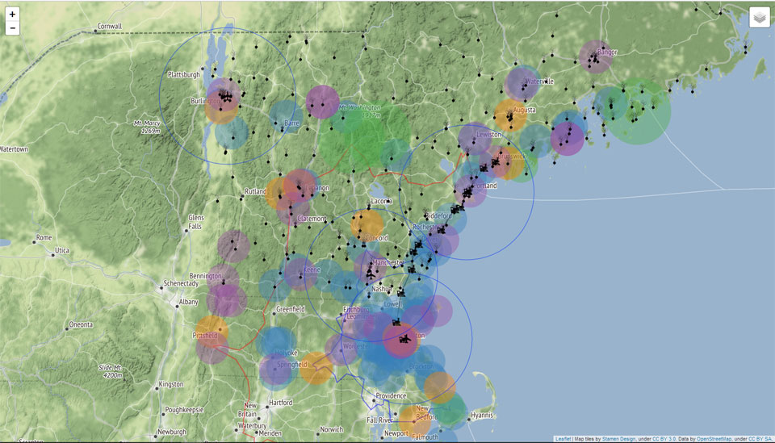

wheretolive
===========

This is an app I build to help us figure out where we should move. It includes local airports, train stations, farmers' markets, Waldorf/Montessori/democratic schools, and other stuff!

It lives at http://bobholt.github.io/wheretolive/.

There's a menu of layers to show in the top right. It looks like this:

Based on [Roostagram](https://github.com/bocoup-education/roost-chicago-2014-app), a Backbone sample app created for [Bocoup](https://bocoup.com/)'s Backbone.js Training.
